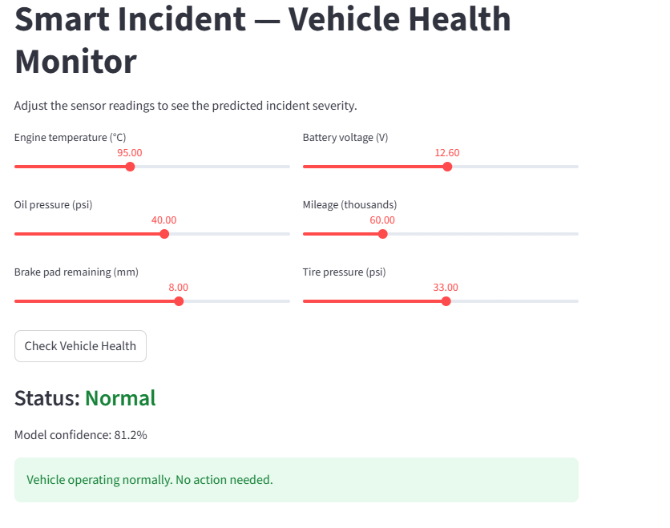
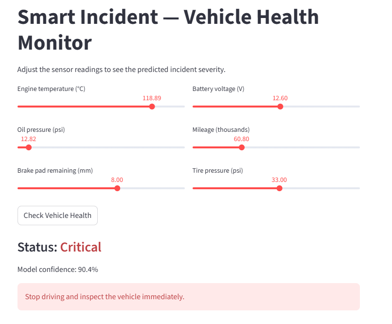
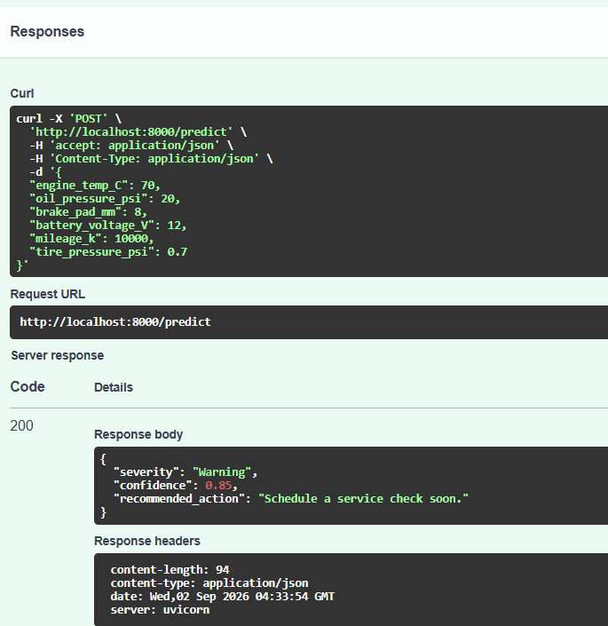

# Smart Incident Analysis & Response Recommendation System

This project combines machine learning with a decision-support layer to analyze vehicle health incidents. The system predicts **incident severity** from onboard vehicle sensor readings and returns a plain-language **recommended action**, so a non-technical operator can quickly understand how serious an issue is and what to do about it.

The trained model is served through a **FastAPI** REST API, exposed to users through an interactive **Streamlit** dashboard, and packaged with **Docker** so it runs identically in any environment.

------

## Dataset

Each record represents a single vehicle's health snapshot from onboard sensors. The dataset is **synthetically generated** with realistic operating ranges, failure rules, and **real-world data imperfections** (missing values, duplicate rows, sensor-glitch outliers, and inconsistent label formatting).

The six features are all intuitive vehicle signals:

| Feature | Description | Healthy range |
|---|---|---|
| `engine_temp_C` | Engine temperature (deg C) | ~90-100 |
| `oil_pressure_psi` | Oil pressure (psi) | ~30-50 |
| `brake_pad_mm` | Brake pad material remaining (mm) | higher is better |
| `battery_voltage_V` | Battery voltage (V) | ~12.4-12.7 |
| `mileage_k` | Total mileage (thousands) | - |
| `tire_pressure_psi` | Tire pressure (psi) | ~32-35 |


---

## Problem Statement

The goal is to predict **incident severity** from the sensor readings:

- **Normal** - vehicle operating within expected ranges
- **Warning** - a reading is drifting out of range; attention needed soon
- **Critical** - a dangerous reading or combination requiring immediate action

The model output is then mapped to a practical response recommendation:

| Severity | Recommended action |
|---|---|
| Normal | No action needed. Vehicle operating normally. |
| Warning | Schedule a service check soon. |
| Critical | Stop driving and inspect the vehicle immediately. |

---

## Data Cleaning & Pre-processing

The raw dataset is deliberately messy, like real sensor data. `01_train_model.py` performs the following cleaning steps before training:

1. **Drop the ID column** - `vehicle_id` is an identifier, not a predictive feature.
2. **Remove duplicate rows** - identical readings logged twice would bias the model and can leak between train and test.
3. **Standardize the labels** - fix inconsistent case and whitespace (e.g. `WARNING`, ` normal ` become `Warning`, `Normal`) so classes aren't split.
4. **Handle impossible values** - physically impossible sensor readings (e.g. negative temperatures) are flagged as missing so they can't be trusted.
5. **Impute missing values** - fill gaps with the column **median**, which is robust to outliers.

The cleaned data is saved as `vehicle_health_clean.csv`.

---

## Approach

1. **Model** - a Random Forest classifier predicts severity from the six sensor features. The classes are imbalanced (Critical is rare), so the model is trained with `class_weight="balanced"` and evaluated with per-class precision and recall rather than accuracy alone.
2. **LLM explanation layer** - the model's prediction plus the sensor context is passed to a large language model through a carefully engineered prompt, which produces a plain-language explanation and a recommended action for a non-technical user. The prompt uses a system role with anti-hallucination rules, few-shot examples, structured grounded context, and enforced JSON output at temperature 0. A lightweight rule-based fallback is also available for offline use.
3. **Serving (FastAPI)** - the model is exposed as a `/predict` REST endpoint that accepts sensor readings and returns the severity and recommended action, with automatic input validation.
4. **Interface (Streamlit)** - an interactive dashboard lets a user set the readings with sliders and see the predicted status and recommendation, color-coded.
5. **Containerization (Docker)** - the API is packaged into a container image so it runs the same way on any machine.

---

## Results

On a held-out test set (25% of the data, stratified to preserve class balance):

- **Overall accuracy: ~96%**
- Per-class F1: Normal 0.97, Warning 0.95, Critical 0.84
**Feature importance** (what drives the predictions):

| Feature | Importance |
|---|---|
| Brake pad wear | 0.58 |
| Battery voltage | 0.18 |
| Engine temperature | 0.09 |
| Tire pressure | 0.07 |
| Oil pressure | 0.07 |
| Mileage | 0.02 |


---

## Project Structure

```
├── 01_train_model.py        # cleans the data, trains the model, saves it
├── 02_llm_layer.py          # LLM layer: prompt-engineered explanations + actions
├── app.py                   # FastAPI service (serves the model as /predict)
├── dashboard.py             # Streamlit dashboard (interactive UI)
├── Dockerfile               # containerizes the FastAPI service
├── requirements.txt         # dependencies
├── .dockerignore
├── .gitignore
├── incident_model.pkl       # trained model
├── vehicle_health_raw.csv   # generated raw dataset (with imperfections)
└── vehicle_health_clean.csv # cleaned dataset (after pre-processing)
```

---

## How to Run


### 1. Clean the data and train the model
```bash
python 01_train_model.py
```

### 2. (Optional) Run the LLM explanation layer
```bash
python 02_llm_layer.py            # offline demo (rule-based fallback, no key needed)
python 02_llm_layer.py --real     # uses a real LLM API
```
For the real mode, install the client and set an API key:
```bash
pip install google-genai scikit-learn pandas numpy
set GEMINI_API_KEY=AIza-your-key-here
```

### 4. Run the FastAPI service
```bash
uvicorn app:app --reload --port 8000
```
Then open **http://localhost:8000/docs** for the interactive API documentation

### 5. Run the Streamlit dashboard
```bash
streamlit run dashboard.py
```
Opens at **http://localhost:8501**.

### 6. Run with Docker
```bash
docker build -t incident-api .
docker run -p 8000:8000 incident-api
```
The API is then available at **http://localhost:8000/docs**, running inside a container.

---

## Screenshots


**Streamlit dashboard - Normal status**




**Streamlit dashboard - Critical status**




**FastAPI interactive docs (/docs)**



---

## Tech Stack

- **Python** - scikit-learn, pandas, NumPy
- **FastAPI** + **Uvicorn** - model serving
- **Streamlit** - interactive dashboard
- **Docker** - containerization

---

## Notes & Limitations

- The dataset is **synthetic** (generated with realistic rules and imperfections), used to demonstrate the end-to-end approach rather than to report results on a specific fleet.
- The model uses a **snapshot** of current readings; tracking how readings change over time would catch developing problems earlier.
- This is a **demonstration project**, not a production system. A production deployment would add authentication, logging, input-range validation, model monitoring and retraining, and validation of the recommended actions.
