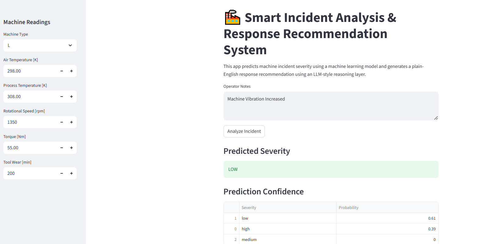
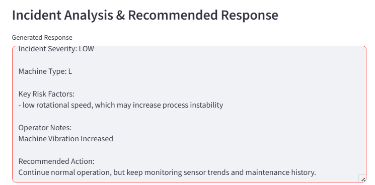

# Smart Incident Analysis & Response Recommendation System

This project combines machine learning and LLM-style natural language reasoning to analyze industrial machine incidents.

The system predicts incident severity using machine sensor/process data and generates a plain-English explanation with recommended actions.

## Project Motivation

In manufacturing, robotics, logistics, and industrial operations, teams often receive machine readings and operator notes but need help deciding how serious an issue is and what action to take.

This project demonstrates how machine learning can support incident triage, while an LLM-style reasoning layer can make the model output easier for humans to understand.

## Dataset

This project uses the AI4I 2020 Predictive Maintenance Dataset from the UCI Machine Learning Repository.

The dataset includes machine operating features such as:

- Machine type
- Air temperature
- Process temperature
- Rotational speed
- Torque
- Tool wear
- Machine failure labels
- Failure mode labels

Dataset source:

AI4I 2020 Predictive Maintenance Dataset, UCI Machine Learning Repository  
https://archive.ics.uci.edu/dataset/601/ai4i+2020+predictive+maintenance+dataset

## Problem Statement

The goal is to predict incident severity:

- Low
- Medium
- High

Then generate a practical response recommendation based on:

- Model prediction
- Machine readings
- Operator notes

##To Run
pip install -r requirements.txt
python train_model.py
streamlit run app.py

## Screenshots

  

  

